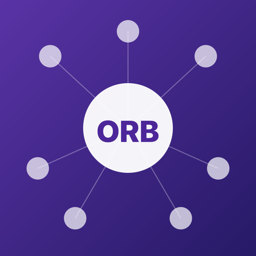

<p align="center">
  
</p>

<h1 align="center">ORB</h1>

<p align="center">
  <strong>OpenRouter Browser</strong>: a native macOS app for finding, comparing, chatting with, and building on the models available through <a href="https://openrouter.ai">OpenRouter</a>.
</p>

<p align="center">
  <a href="https://github.com/Eplisium/orb/actions/workflows/ci.yml"></a>
  
  
  
  <a href="LICENSE"></a>
</p>

<p align="center">
  Built with SwiftUI and Swift Package Manager. No Xcode project is needed.
</p>

---

## Screenshots

<!-- screenshots -->
<!-- Add PNGs under docs/images/ (for example browser.png, chat.png, agent.png, studio.png) and reference them here. -->

## Install

### Download a build

Every CI run on `main` uploads an ad-hoc signed `ORB.app` as the **ORB-adhoc-&lt;sha&gt;** artifact on the [Actions page](https://github.com/Eplisium/orb/actions/workflows/ci.yml). It is not notarized, so on first launch:

1. Unzip it and move `ORB.app` to `/Applications`.
2. **Right-click → Open**, then confirm **Open** in the dialog. Double-clicking will not offer that option the first time. On recent macOS versions you may need **System Settings → Privacy & Security → Open Anyway** instead.

An ad-hoc signature changes with every build, so macOS treats each new download as a different app. Expect Keychain and privacy prompts again after you update.

### Build from source

Requirements: macOS 14 Sonoma or newer and Swift 5.9 or newer (Command Line Tools or Xcode).

```bash
git clone https://github.com/Eplisium/orb.git
cd orb
swift build
bash build_app.sh --adhoc
open ORB.app
```

`build_app.sh` packages the SwiftPM binary into `ORB.app`. It reads the version from [`VERSION`](VERSION), sets the build number to the git commit count, copies the committed icon from `Resources/AppIcon.icns`, and signs the bundle.

| Option | Effect |
|---|---|
| `--release` / `CONFIG=release` | Package the release build (run `swift build -c release` first, or add `--build`) |
| `--build` | Run `swift build` for the chosen configuration first |
| `--adhoc` | Ad-hoc signature (`codesign -s -`). Always used when `$CI` is set |
| `--output DIR` | Write the bundle somewhere other than the repository root |

Without `--adhoc`, the script creates a stable self-signed identity (kept in the git-ignored `codesign/` directory and added to your login keychain) and signs with [`rcodesign`](https://github.com/indygreg/apple-platform-rs) if it is installed. Because the identity stays the same across rebuilds, Keychain access and privacy grants survive local rebuilds.

You need an [OpenRouter API key](https://openrouter.ai/settings/keys) for Chat, Agent, and Generate. The model browser works without a key.

## Features

- **Model browser:** browse the public OpenRouter catalog. Search, filter by modality and capability, and sort by price, context, or date. The detail view shows architecture, pricing, supported parameters, benchmarks, and per-provider endpoint data (latency, throughput, uptime, quantization). You can compare models side by side and keep favorites and notes.
- **Chat:** stream completions with full generation controls: temperature, max tokens, reasoning effort, provider routing, fallbacks, and response formats. Messages render as Markdown and keep reasoning disclosures inline in arrival order. Chat also supports multimodal attachments, live token, cost, and context tracking, session search, pinning, branching, and export.
- **Agent:** ORB runs its own function-calling loop against OpenRouter, with web fetch and search, workspace file tools, cancellable shell commands, AppleScript, screen capture, mouse and keyboard control, memory, and planning. Risky tools ask for approval first, and tool calls appear as cards in the transcript.
- **MCP:** connect stdio Model Context Protocol servers, or import a standard `mcpServers` JSON file. Settings can probe each server. Tools, resources, and prompts are bridged under `mcp__<server>__<tool>` names, and secret environment variables can be moved into the Keychain. Note that the Agent doesn't offer MCP tools yet; see [Known limitations](#known-limitations).
- **Generate studio:** separate workspaces for Images, Video (durable, resumable jobs), Speech and transcription, Files, and Embeddings and reranking. Outputs are saved to a shared Library.
- **Account:** credits and activity (these need the optional management key), plus a local usage and cost ledger with charts in Settings.
- **Test Suite:** run built-in project scenarios and text probes across models. Verdicts are deterministic: a project run only passes when its artifacts check out, and a plain text answer is marked "unverified" instead of passed. Paid comparison runs require you to pick the models and set a dollar ceiling.
- **App shell:** command palette, onboarding, tabbed Settings, accent and text-size preferences, and a Touch ID / password app lock (on by default, configurable in Settings).

## Security model

ORB holds credentials and can run tools with your user account's permissions. Read this section before you enable Computer Access.

- **Two credential roles.** The **inference key** is used for Chat, Agent, and Generate. The optional **management key** is used only for account-wide reads: credits, activity, and management inventory. Each key is stored in its own Keychain item and is never sent to an endpoint meant for the other role. Account features make no network request at all if the management key is missing. Keys are never written to preferences or logs, and API error messages are redacted before they are shown.
- **Computer Access = your permissions.** The Agent runs Web Only by default: web tools, memory, and planning only. No files, shell, computer control, or MCP tools. When you turn on Computer Access, native tools run as *you*. They can read and write files, run shell commands, automate apps, capture the screen, and send input. One deny-by-default policy controls both which tools are offered to the model and which calls are allowed to execute, and unknown tool names are always refused.
- **A workspace is not a sandbox.** The workspace folder limits ORB's own file tools (path traversal, `~`, and symlink escapes are rejected). Shell commands can still reach anything your account can.
- **Approvals.** Terminal, computer-control, and MCP tool calls stop and wait for your approval. If you deny or stop, the model receives a tool error. **OP Mode** (off by default, in Settings) skips these prompts. It does not grant capabilities the session doesn't already have.
- **MCP servers run as local subprocesses** with your permissions. Only add servers you trust. The tool policy offers or runs an MCP tool only if the session has the MCP capability *and* that specific server is approved. Every call also goes through the approval prompt. Secret references that can't be resolved stop the server from launching, so a placeholder value is never passed to it.
- **Media downloads.** Generated media from unsigned URLs is fetched without credentials. ORB only sends a bearer token to `https://openrouter.ai/api/…`.

To report a vulnerability, see [SECURITY.md](SECURITY.md).

## Architecture

ORB is a single SwiftPM executable target (`Sources/ORB`) plus one test target (`Tests/ORBTests`). Views and services are `@MainActor`, and MCP connections are actors. Streaming uses a `URLSessionDataDelegate` transport that passes each network chunk into an incremental SSE decoder, so tokens render as soon as they arrive. Persistence is SQLite in WAL mode under `~/Library/Application Support/ORB/`, with idempotent migrations and a fallback to a temporary database if the file is corrupt. Generated assets are stored content-addressed (SHA-256) next to the database.

See [docs/ARCHITECTURE.md](docs/ARCHITECTURE.md) for the module map and data flow.

## Development

```bash
swift build
swift test                                  # full offline suite
swift test --filter ToolPolicyTests         # one suite
bash scripts/count_warnings.sh build.log    # unique warnings in a saved build log
```

The test suite runs offline. It never reads your Keychain, never calls OpenRouter with a key, and isolates SQLite to temporary files. A few tests need explicit opt-in and show as **skipped** unless their environment variable is set:

| Variable | Test | Notes |
|---|---|---|
| `RUN_OPENROUTER_INTEGRATION=1` | Live agent round trip | Uses your saved key and **spends credits** |
| `ORB_STREAM_SNAPSHOT_DIR=<dir>` | Streaming presentation snapshots | Writes PNGs |
| `ORB_REASONING_SNAPSHOT=<file.png>` | Reasoning layout snapshot | Writes a PNG |
| `NODE_BINARY=<path>` | MCP live tests | Only needed if `node` isn't in a standard location |

Run the snapshot tests **on their own**, never together with the full suite. `ImageRenderer` blocks the main actor, which skews the streaming-timing tests:

```bash
ORB_STREAM_SNAPSHOT_DIR=/tmp/orb-snapshots swift test --filter StreamingPresentationSnapshotTests
ORB_REASONING_SNAPSHOT=/tmp/reasoning.png swift test --filter ReasoningPresentationTests
```

Strict concurrency checking (`StrictConcurrency=targeted`) is enabled as warnings in `Package.swift`. The package still builds in Swift 5 language mode.

### Continuous integration

[`.github/workflows/ci.yml`](.github/workflows/ci.yml) runs on pushes and pull requests to `main`, and can also be started manually. It runs on `macos-15` with the latest stable Xcode and caches `.build`. The steps are:

1. `swift build --build-tests`, then a unique-warning count written to the job summary.
2. `swift test --skip-build` (opt-in tests stay skipped; CI never sets the variables above).
3. `build_app.sh --adhoc`, uploaded as a zipped `ORB.app` artifact.
4. Build, test, and package logs are uploaded as an artifact, including when the run fails.

## Known limitations

- **Not notarized.** Downloaded builds are ad-hoc signed and need right-click → Open. Keychain and privacy prompts come back after each update.
- **MCP tools are not offered to the Agent yet.** The policy requires per-server approval, but the app has no way to grant it yet, so connected servers' tools are filtered out (fail-closed). You can still connect and probe servers in Settings.
- **Agent permission levels.** The Agent UI only offers Web Only or Computer Access. Finer policy presets (workspace read, workspace write, terminal only) exist internally and are used by the Test Suite, but you can't choose them in the Agent.
- **Management features are read-only.** ORB can list keys, BYOK credentials, guardrails, workspaces, and similar inventory, but it can't create or rotate keys, change budgets, or assign guardrails.
- **Responses, Messages, and batch APIs.** Adapters exist and are contract-tested, but Chat and Agent use chat completions only, and batches have no UI.
- **Test Suite verdicts are deterministic.** There is no LLM-judge score and no way to record a human review. Text answers stay "unverified". The spend ceiling only counts reported costs, and a single request can go over it.
- **Encrypted reasoning isn't shown.** Signed or encrypted reasoning blocks are preserved byte-for-byte for tool continuation, but only text and summary reasoning is displayed.
- **No attribution referer.** ORB sends `X-OpenRouter-Title: ORB` but no `HTTP-Referer`.

## Contributing, changelog, license

- [CONTRIBUTING.md](CONTRIBUTING.md): setup, test expectations, commit style.
- [CHANGELOG.md](CHANGELOG.md): release notes.
- [SECURITY.md](SECURITY.md): how to report vulnerabilities.
- MIT licensed. See [LICENSE](LICENSE).
